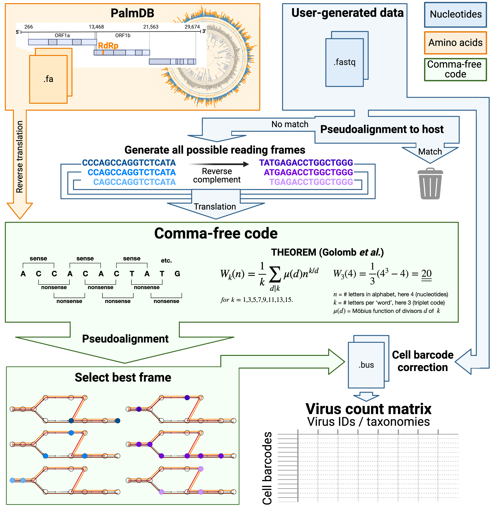

Pseudoalignment of RNA seq data against a protein reference
=======================================

.. note:: **Reference:**
   Luebbert L, Sullivan DK, Carilli M, Eldjárn Hjörleifsson K, Viloria Winnett A, Chari T, Pachter L.  
   `Efficient and accurate detection of viral sequences at single-cell resolution reveals putative novel viruses perturbing host gene expression. <https://doi.org/10.1101/2023.12.11.571168>`_  
   bioRxiv 2023.12.11.571168  
   https://doi.org/10.1101/2023.12.11.571168

kallisto can perform translated pseudoalignment of nucleotide sequences against an amino acid reference while retaining single-cell (for single-cell RNA sequencing data) or sample (for bulk RNA seq data) resolution.

Translated pseudoalignment is performed by first reverse translating the amino acid reference sequences and all possible reading frames (three forward and three reverse) of the nucleotide sequencing reads to comma-free code [1]_. A comma-free code is a set of k-letter ‘words’ selected such that any off-frame k-mers formed by adjacent letters do not constitute a ‘word’, and will thus be interpreted as ‘nonsense’. For k=3 (a triplet code) and 4 letters (e.g., ‘A’, ‘T’, ‘C’, and ‘G’), this results in exactly 20 possible words, which equals the number of amino acids specified by the universal genetic code. Due to the serendipity of these numbers, Crick et al. hypothesized the genetic code to be a comma-free code in 1957 [2]_. Finally, the six reading frames of the sequencing reads translated to comma-free code are pseudoaligned to the reference sequences reverse translated to comma-free code. If several reading frames of the same read produce alignments, the best frame is chosen.

The workflow can be executed in three lines of code, and computational requirements do not exceed those of a standard laptop. Building on kallisto’s versatility, the workflow is compatible with all state-of-the-art single-cell and bulk RNA sequencing methods, including but not limited to 10x Genomics, Drop-Seq [3]_, SMART-Seq [4]_, SPLiT-Seq [5]_ (including Parse Biosciences), and spatial methods such as Visium.

The translated alignment workflows can be used to align RNA sequencing data to any protein reference. However, we first described its use in combination with the `PalmDB viral protein database <https://github.com/ababaian/palmdb>`_ for the detection of viral sequences in RNA sequencing data:

1. Install `kb-python` (optional: install `gget` to fetch the host genome and transcriptome):

.. code-block:: bash

   pip install kb-python gget

2. Download optimized PalmDB reference files:

.. code-block:: bash

   wget https://raw.githubusercontent.com/pachterlab/LSCHWCP_2023/main/PalmDB/palmdb_rdrp_seqs.fa
   wget https://raw.githubusercontent.com/pachterlab/LSCHWCP_2023/main/PalmDB/palmdb_clustered_t2g.txt

3. Create reference index (optional masking of the host, here human, genome using the D-list):

.. code-block:: bash

   # Single-thread runtime: 1.5 h; Max RAM: 4.4 GB; Size of generated index: 593 MB
   # Without D-list: Single-thread runtime: 3.5 min; Max RAM: 3.9 GB; Size of generated index: 592 MB
   kb ref \
       --aa \
       --d-list $(gget ref --ftp -w dna homo_sapiens) \
       -i index.idx --workflow custom \
       palmdb_rdrp_seqs.fa

4. Align sequencing reads:

.. code-block:: bash

   # Single-thread runtime: 1.5 min / 1 million sequences; Max RAM: 2.1 GB
   kb count \
       --aa \
       -i index.idx -g palmdb_clustered_t2g.txt \
       --parity single \
       -x default \
       $USER_DATA.fastq.gz

.. [1] Golomb, S. W., Gordon, B. & Welch, L. R. Comma-Free Codes. Canad. J. Math. 10, 202–209 (1958).
.. [2] Crick, F. H., Griffith, J. S. & Orgel, L. E. CODES WITHOUT COMMAS. Proc. Natl. Acad. Sci. U. S. A. 43, 416–421 (1957).
.. [3] Macosko, E. Z. et al. Highly Parallel Genome-wide Expression Profiling of Individual Cells Using Nanoliter Droplets. Cell 161, 1202–1214 (2015).
.. [4] Ramsköld, D. et al. Full-length mRNA-Seq from single-cell levels of RNA and individual circulating tumor cells. Nat. Biotechnol. 30, 777–782 (2012).
.. [5] Rosenberg, A. B. et al. Single-cell profiling of the developing mouse brain and spinal cord with split-pool barcoding. Science 360, 176–182 (2018).
